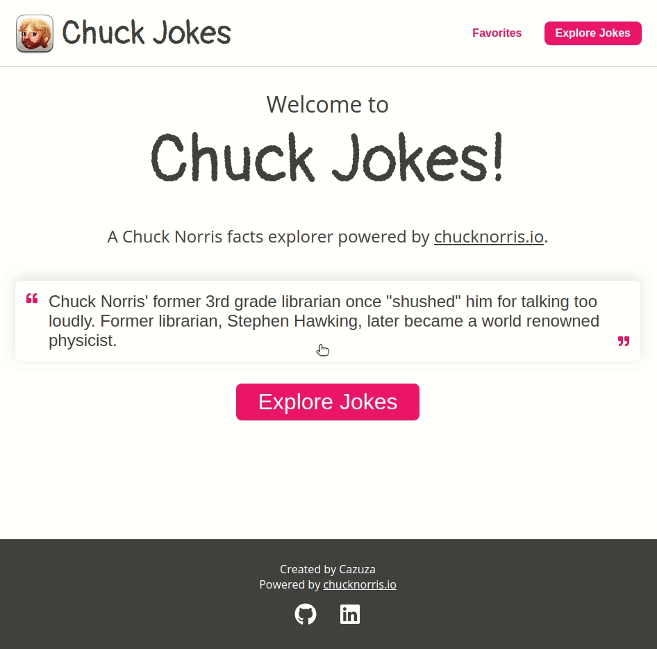

  

<h1 align="center" >Fake Trello</h1>

<blockquote align="center">
  Challenge made during the selection process for the company GuiaBolso.
</blockquote>

  

  

  

<h3 align="center">
|&nbsp;&nbsp;&nbsp;
  <a href="https://cazuzabarberino.github.io/Chuck-Jokes/#/" target="_blank">
    Live Demo
  </a>
  &nbsp;&nbsp;&nbsp;|
</h3>

  

## Contents

- [Motivation](#Motivation)
- [Features](#Features)
- [Libraries & Technologies](#libraries--technologies)
- [Instalation](#Instalation)

## Motivation

This project is part of the selection process of the company GuiaBolso.
In this project I improved my knowledge in react hooks and I was able to learn more about how to manage the state using redux and redux-saga.

## Features

- Explore chuck norris facts.
- Filter them by multiple categories.
- Save your favorite jokes.
- Share jokes on facebook, whatsapp, twitter or reddit.

## Libraries & Technologies

#### :wrench: Main Technologies:

- React JS
- TypeScript

#### :file_folder: Libraries:

- Axios
- Polished
- React Icons
- React Redux
- React Share
- Redux
- Redux Saga
- Styled Components

#### :earth_americas: Placeholder Text Api:

- [ChuckNorris.io](https://api.chucknorris.io/)

## Instalation

1. Have [Node.js](https://nodejs.org/en/) and [Yarn](https://yarnpkg.com/) installed.
1. Clone the project by running this command: `https://github.com/cazuzabarberino/Chuck-Jokes.git`
1. Go to the project's folder and run `yarn install` to install dependencies.
1. Run `yarn start`
